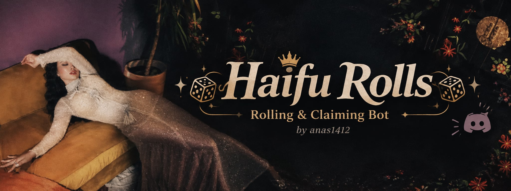

# Haifu Rolls



**[➕ Add Haifu Rolls to your server](https://discord.com/oauth2/authorize?client_id=1545127309353287761&scope=bot%20applications.commands&permissions=2147534848)**
The bot is hosted and online 24/7. No setup needed. It asks only for Send Messages, Embed Links, Attach Files, and slash commands. No admin.

Mudae-style card game for Discord. Every card is a Haifa Wehbe photo.
**500 cards are included** in `images/` with hand-picked rarities and Arabic names (`seed.json`).
Any new photo you drop in later gets a random **rarity** (weighted dice) and a name from a curated list.

## Commands

| Command | What it does |
|---|---|
| `/roll` | Roll a random card. Unclaimed cards show a claim button for 30 seconds |
| `/collection [member]` | Summary page plus one card per page with its photo. Prev / next buttons, greyed out after 2 idle minutes |
| `/card <name>` | Look up a card and see who owns it |
| `/top` | Leaderboard by points |
| `/divorce <name>` | Release a card you own |
| `/gift <member> <name>` | Give a card away |
| `/exchange <member> <my_card> <their_card>` | Propose a trade. The other member gets Accept / Decline buttons (5 min) |
| `/rescan` | (Manage Server) register new photos in `images/` |
| `/backup` | (bot owner) download the database file |
| `/restore <file>` | (bot owner) replace the database with an uploaded `haifa.db` |

## Rarity

| Tier | Roll chance | Points |
|---|---|---|
| ⚪ عادية | 50% | 1 |
| 🟢 مميزة | 28% | 3 |
| 🔵 نادرة | 14% | 8 |
| 🟣 أسطورية | 6% | 20 |
| 👑 الملكة | 2% | 50 |

Rolls only show cards nobody in the server owns yet (`ROLL_ONLY_UNCLAIMED` in `src/config.ts`; set to `False` to roll owned cards too).

Limits: **3 rolls per day**, **1 claim per day**. Both reset at **midnight**, local time of the machine running the bot. Numbers live in `src/config.ts`.

## Run your own copy (optional)

1. Create the bot at https://discord.com/developers/applications → New Application → Bot → **Reset Token**, copy it.
2. Same page → OAuth2 → URL Generator: scope `bot` + `applications.commands`,
   permissions `Send Messages`, `Embed Links`, `Attach Files`. Open the URL to invite the bot to your server.
3. Install [Bun](https://bun.sh) (one command, no admin rights), then install the two dependencies:

```bash
bun install
```

4. Create a file named `.env` in this folder with one line. Bun loads it automatically.

```
DISCORD_TOKEN=paste_token_here
```

5. Start the bot:

```bash
bun start
```

`bun start` runs with `--smol`, which trades a little speed for a smaller memory footprint. Handy on free hosts.

On first start the bot registers the 500 seeded cards. Add more photos to `images/` later and run `/rescan`.

Slash commands can take up to an hour to appear the first time. Kick the bot and re-invite it if they don't show.

## Card images: attachments or URLs

Card images are served from this repo's raw GitHub URLs (`IMAGE_BASE_URL` in `src/config.ts`). This only works while
the repo is **public**. If you make it private, set `IMAGE_BASE_URL = ""` and the bot uploads images as attachments instead.
New photos added with `/rescan` must also be pushed to GitHub before their URL works.

## Images are compressed before commit

`scripts/optimize-images.ts` resizes card images to 1280 px max and re-encodes them as progressive JPEG.
A git hook runs it on every staged image automatically. Enable the hook once per clone:

```bash
git config core.hooksPath hooks
```

To compress everything by hand:

```bash
bun run optimize
```

## Hosting on Railway (persistent database)

Railway wipes the container disk on every deploy, so the database must live on a **Volume**:

1. In your Railway service: **Volumes → Add Volume**, mount path `/data`.
2. **Variables**: add `DB_PATH=/data/haifa.db` (and `DISCORD_TOKEN` if not set yet). Redeploy.
3. Move your existing database from your PC: stop the local bot, then in Discord run
   `/restore` and attach your local `haifa.db`. The bot swaps the file in place and confirms the card count.
4. Any time: `/backup` sends you the current database as a file. Keep one somewhere safe.

`/backup` and `/restore` only work for the owner of the Discord application.

## Files

- `src/index.ts` – Discord bot and commands (discord.js)
- `src/scanner.ts` – registers new photos: uses `seed.json` if the file is listed there, else random (edit the name lists here)
- `seed.json` – the 500 curated cards: file, name, rarity, description. Edit names or rarities here before first run
- `src/db.ts` – SQLite via `bun:sqlite` (`haifa.db`): cards, owners, daily limits. Ownership is per server.
- `src/config.ts` – rarities, weights, points, daily limits, `ROLL_ONLY_UNCLAIMED`, `IMAGE_BASE_URL`
- `scripts/optimize-images.ts` + `hooks/pre-commit` – image compression (sharp), automatic on commit
- `index.html` – landing page with the invite link (open it locally, or serve it from anywhere)
